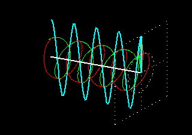
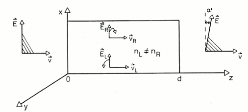
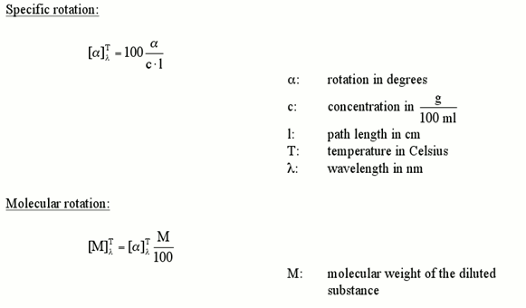
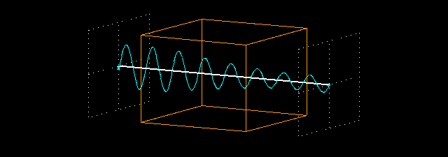
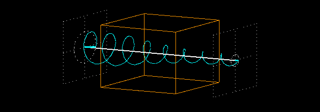
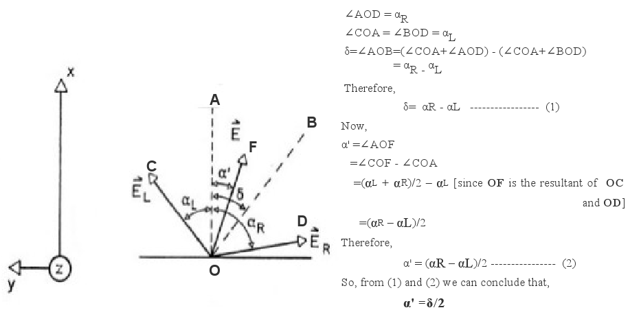

**Recap of Experiment 1**

In experiment:1 we have talked about the phenomenon of polarisation of electromagnetic waves. We have tried to emphasize on two aspects of a plane polarised or linearly polarised wave.  

A plane polarised wave is a composition of a left and a right circularly polarised waves propagating in phase. It is visually described by the following animation. Here the green and the red curve shows propagation of right and left circularly polarised wave respectively. And superposition of them is the blue curve which is a plane polarised wave.  

  

Whenever a electromagnetic wave enters a medium its velocity gets reduced. The ratio of its velocity in vacuum to its velocity in the medium is known as refractive index and is represented by, n = c0 / v where c0 is the velocity of the wave in vacuum and v is the velocity of the wave in the medium  

**Anisotropic Medium And Speed of Light**  

In an isotropic medium the properties of the medium are the same in all directions. But in an anisotropic medium the properties become directionally dependent. Anisotropic materials may have different indices of refraction associated with different crystallographic directions. A common situation is that, there are two distinct indices of refraction, and they are called birefringent materials. In case of optically active chilral molecules, they have different refractive indices for different circularly polarised components of a plane polarised wave(nL ≠ nR). That means, once the plane polarised wave enters the medium speed of its right circular part and left circular part will be different(cL ≠ cR). This property is known as circular birefringence.  

These two aspects together give rise to the phenomena called Optical Rotation, rotation of plane of polarisation of a plane polarised wave after it passes through an optically active medium.  

In experiment 1 we have seen and the Optical Rotation of a light wave (which is an example of EM wave) when it passes through an optically active medium like sugar solution. There we have measured the specific rotation [α]Tλ of the light wave for different concentrations of medium at a fixed wave length of incident light λ~589nm(Na D-line)and fixed temperature T. In the this experiment we are going to observe how the specific rotation changes with wave length of incident light.  

**Dependence of specific rotation on the wavelength: Optical Rotatory Dispersion**  

In an isotropic medium the properties of the medium are the same in all directions. But in an anisotropic medium the properties become directionally dependent. Anisotropic materials may have different indices of refraction associated with different crystallographic directions. A common situation is that, there are two distinct indices of refraction, and they are called [birefringent](https://en.wikipedia.org/wiki/Birefringence) materials. In case of [optically active](https://en.wikipedia.org/wiki/Optical_rotation) chilral molecules, they have different refractive indices for different circularly polarised components of a plane polarised wave(nL ≠ nR). That means, once the plane polarised wave enters the medium speed of its right circular part and left circular part will be different(cL ≠ cR). This property is known as circular birefringence.  

These two aspects together give rise to the phenomena called [Optical Rotation](https://en.wikipedia.org/wiki/Optical_rotation), rotation of plane of polarisation of a plane polarised wave after it passes through an optically active medium.  

In experiment 1 we have seen and the Optical Rotation of a light wave (which is an example of EM wave) when it passes through an optically active medium like sugar solution. There we have measured the specific rotation [α]Tλ of the light wave for different concentrations of medium at a fixed wave length of incident light λ~589nm([Na D-line](https://en.wikipedia.org/wiki/D_Line#Atomic_Spectral_Lines))and fixed temperature T. In the this experiment we are going to observe how the specific rotation changes with wave length of incident light.  

The following figure describes this.  

    

But the superposition of these two oppositely circularly polarised wave will still generate a plane polarised wave with its plane of polarisation rotated to an angle α',as described by the following figure.From the concepts of geometry it may be shown that the angle of rotation α' is half of the phase shift δ.[*]

	      

Now we will see how this angle of rotation depends on the wave length λ of the incident light. To understand the dependence let us first write down the electric vectors of a right circularly polarised and a left circularly polarised wave propagating in the same direction (z) as follows  

ER(z)= Eo/2 cosω(t - z/VR)  
EL(z)= Eo/2 cosω(t - z/VL)  

Here, Eo = the magnitude  

A wave can be characterized by its amplitude and phase. Amplitude of a wave is the maximum displacement of the particles of the medium from its equilibrium position. Whereas phase of a wave is the definition of a point in a waveform. Interaction of the wave with a material effects its velocity and magnitude and this may in turn cause a change in these two characters. If the material is transparent then no change takes place in phase. But in the case of an anisotropic medium there may be difference in velocity of different components of the wave (which causes change in phase). If the medium has absorptive property, then change in amplitude may take place.  

The electric vector of a [EM wave](https://en.wikipedia.org/wiki/D_Line#Atomic_Spectral_Lines) is always perpendicular to the direction of its propagation. For a plane polarised wave the electric vector of its Left circular part (EL) and the electric vector of its Right circular part (E<subR) make equal angles with the plane of polarization (αL and αR) ie they are in phase. As we have discussed, after entering an optically active medium velocities of the two components of a plane polarised wave (vL and vR) differs from each other. As a result the angles that EL and ER make with the initial plane of polarisation, no longer remains the same i.e. αL ≠ αR. This will give rise to a phase shift between the two components of a plane polarised wave ,δ = αL – αR .  

The following figure describes this.  

    

But the superposition of these two oppositely circularly polarised wave will still generate a plane polarised wave with its plane of polarisation rotated to an angle α',as described by the following figure.From the concepts of geometry it may be shown that the angle of rotation α' is half of the phase shift δ.[*]  

	      

Now we will see how this angle of rotation depends on the wave length λ of the incident light. To understand the dependence let us first write down the electric vectors of a right circularly polarised and a left circularly polarised wave propagating in the same direction (z) as follows  

ER(z)= Eo/2 cosω(t - z/VR)  
EL(z)= Eo/2 cosω(t - z/VL)  

Here, Eo = the magnitude  
ω = angular frequency  
z = distance traveled  
v = velocity in the medium of the wave  

At any instant, the resultant of ER and EL (i.e. ER + EL) will produce a plane polarised wave. We will see how much phase shift is generated when a wave travels a distance, say d, through an optically active medium. For that we can look at the equations of waves at z = 0 and at z = d.  

ER(o)= Eo/2 cosω t  
EL(o)= Eo/2 cosω t  

ER(d)= Eo/2 cosω(t - d/VR)  
EL(d)= Eo/2 cosω(t - d/VL)  

Applying trigonometric laws we can show that the phase difference between ER(0)+E,sub>L(0) and ER(d)+E,sub>L(d) is given by  

δ=ω .d (1/VR - 1/VL)=ω .d/c (nL - nR)  

Now as we know, velocity of any EM wave in any medium = (wave length of wave in the mediun) X (frequency in that medium) and angular frequency = 2πX frequency of wave. So,  

δ=2π/λ(nL - nR)d  

But α'= δ /2. So we can have angle of rotation directly as a function of wave length as,  

α '= δ/2= π/λ(nL - nR)d  

So with change in the wavelength of a light, its optical rotation will also change for the same medium. This phenomena is known as [Optical Rotatory Dispersion](https://en.wikipedia.org/wiki/Optical_rotatory_dispersion).  

In practical purpose, to study ORD one usually looks at two parameters – [specific rotation](https://en.wikipedia.org/wiki/Specific_rotation) [α]Tλ and molecular rotation [M]Tλ. They are defined as follows.    

A plot of [α]Tλ or [M]Tλwith wavelength λ is known as ORD spectra. From an ORD spectra of an unknown material we can have an understanding of the optical properties of the material.  

**Absorption and Extinction Coefficient- A Recap**

When an EM wave passes through a medium, the energy of its photon may be taken up by the electrons of the atoms of the medium. This is called [absorption](https://en.wikipedia.org/wiki/Absorption_(electromagnetic_radiation)). As a result the wave loses its energy and its amplitude gets reduced. This is called attenuation of a wave. Absorption may occur for any type of polarised wave. The following figures exhibit how a linearly polarised wave and a circularly polarised wave are attenuated by an absorptive medium.   

               
	
Absorption of plane polarised light	Absorption of circularly polarised light

The ratio of radiant power transmitted (P) by a sample to the radiant power incident (P0) on the sample is called the transmittance, T: T = P/P0  

Absorbance (A), then, is defined as the logarithm (base 10) of the reciprocal of the transmittance:  
A = -log T = log (1/T)  

In a spectrophotometer, monochromatic plane-parallel light enters a sample at right angles to the plane-surface of the sample. In these conditions, the transmittance and absorbance of a sample depends on the molar concentration (c), light path length in centimetres (L), and molar absorptivity (ε) for the dissolved substance at the specified wavelength (λ).  
Tλ = 10εcL or Aλ = εcL  

Beer’s Law states that molar absorptivity is constant (and the absorbance is proportional to concentration) for a given substance dissolved in a given solute and measured at a given wavelength.  

For this reason, molar absorptivities are called molar absorption coefficients or molar extinction coefficients. Because transmittance and absorbance are unitless, the units for molar absorptivity must cancel with units of measure in concentration and light path. Therefore, molar absorptivities have units of M-1cm-1.  

**Circular Dichroism – The transformation of plane polarized light into elliptically polarized light**  

Some asymmetric (chiral) materials possess a special property that they absorb left circularly polarized light (LCPL) to a different extent than right circularly polarized light(RCPL). Such materials are said to be exhibiting the phenomenon of Circular Dichroism or CD (The word 'dichroism' means that the material absorbs two different types of light differently).  

Following Beer's law if absorbance of LCPL AL is different from absorbance of RCPL AR then,  
AR ≠AL  
i.e. εRcL ≠εLcL  
i.e. εR ≠ εL  

We can study the effects of circular dichroism as a difference between molar extinction coefficients (∆ε = εR - εL) of LCPL and RCPL.  

Now let us discuss the results of circular dichroism on a plane polarised light. So if a plane polarised light enters a a circular dichroic substance its two circular components undergo through separate absorptive effect of the medium. So the resultant wave will no longer be a linearly polarized wave i.e. the resulting field vector does not oscillate along a straight line but it rotates along an ellipsoid path. Such a light wave is called an elliptically polarized light. The direction of rotation of the elliptically polarized light (or, more exactly, its field vector) is determined by the circular component that remains stronger after traversing the material  

**Figure demonstrating the concept of elliptical polarization of light and CD**

		     

As is evident from the figure above, one of the axis of the ellipse is parallel to the polarization plane of the original light wave and another is orthogonal to it. This is the case when the material doesn't show any refraction. However, there may be a difference between the refractive indices of the material for the RCPL and LCPL as well. Then the axis of of the elliptically polarised resultant wave undergoes a rotion and no longer remains parallel to the plane of polarisation of the original wave any more. The material is said to posses both Circular Birefringence and Circular Dichroism.  

As we have measured ORD by specific rotation, in this case we also use parameters like delta absorbance, molar circular dichroism, molar ellipticity, molar residue ellipticity etc to measure the CD. Here are definition, description and the inter relation of these parameters.  

**Goal of The Experiment**

This experiment has two parts. The first part elaborates the effect of an anisotropic medium on the velocity of light passing through it. It shows how the plane of polarisation of a plane polarised light changes when RI of its two circularly polarised components are different from each other. It also describes the dispersive phenomena of optical rotation caused by the medium.  

The second part of the experiment demonestrates the effect of an anisotropic medium on the amplitude of the wave passing through it. It exhibits how state of polarisation of a plane polarised wave changes when rate of absorbance of its two circularly polarised components are different.  

**Notes:**

[*]Geometric explanation of α'= δ/2

